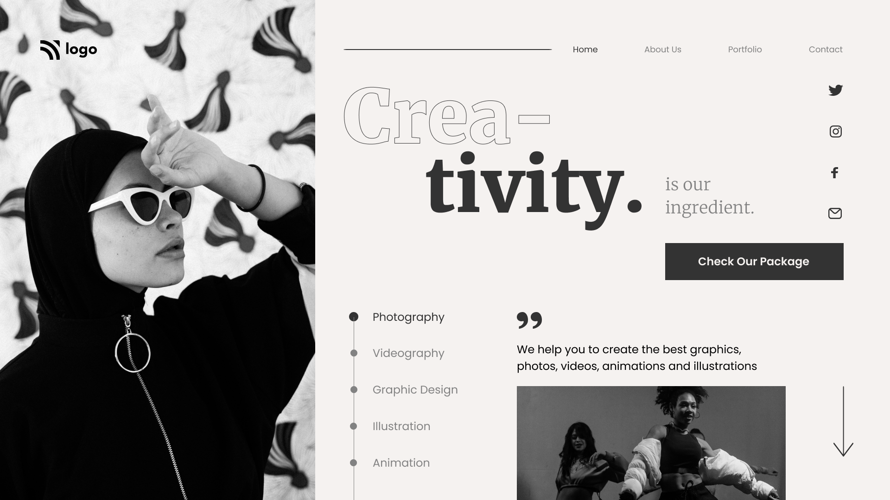

# Interior Design Landing Page

  

## [Live Preview](#) :link:

## Project Goal :dart:

To make the landing page for an imaginary business and mockup was provided. This web page is not responsive as of now.

## Skills Gained

- Using `flex-basis` for complex layouts.
- Using `-webkit-text-fill-color` `-webkit-text-fill-color`
  `-webkit-text-stroke-width`properties to create stroke text.

## Time Taken

```
4.5 Hours
```

## Intended Outcome:



> This project is part of full stack Javascript web-dev bootcamp hosted by [iNeuron.](https://ineuron.ai/)
